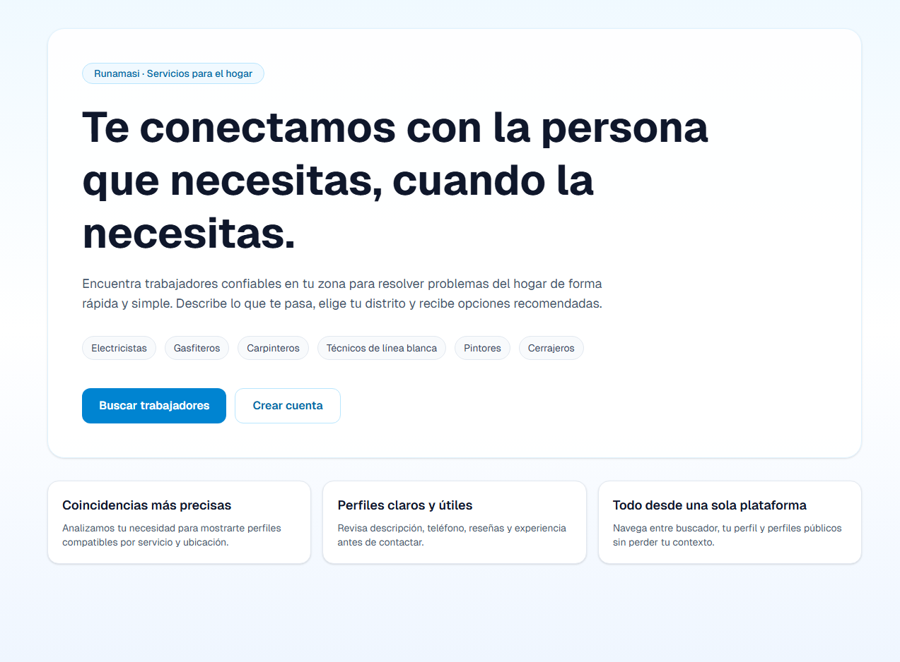
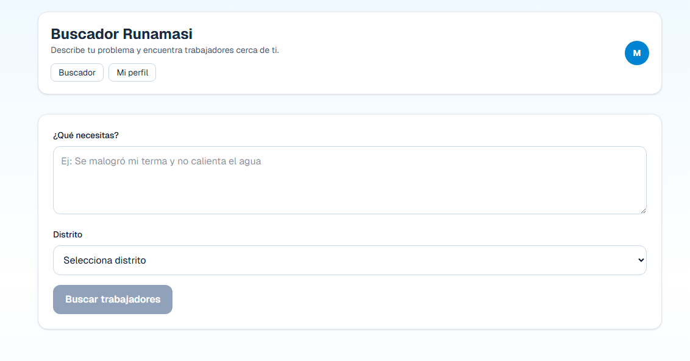
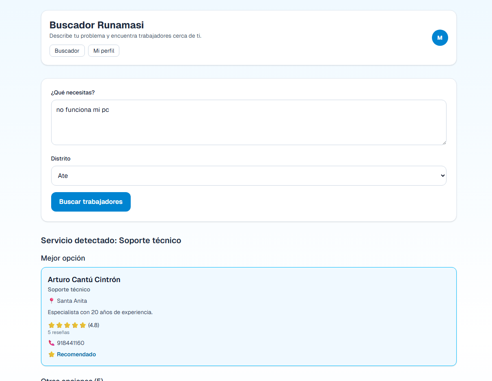
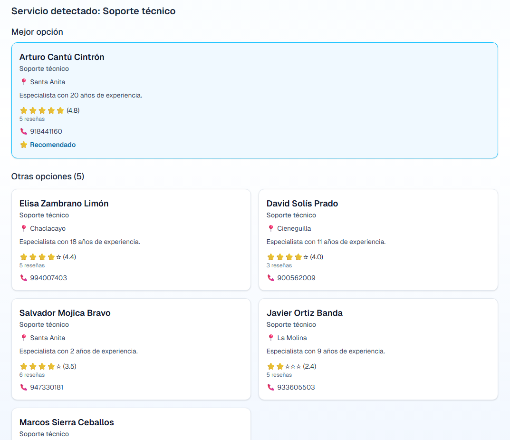
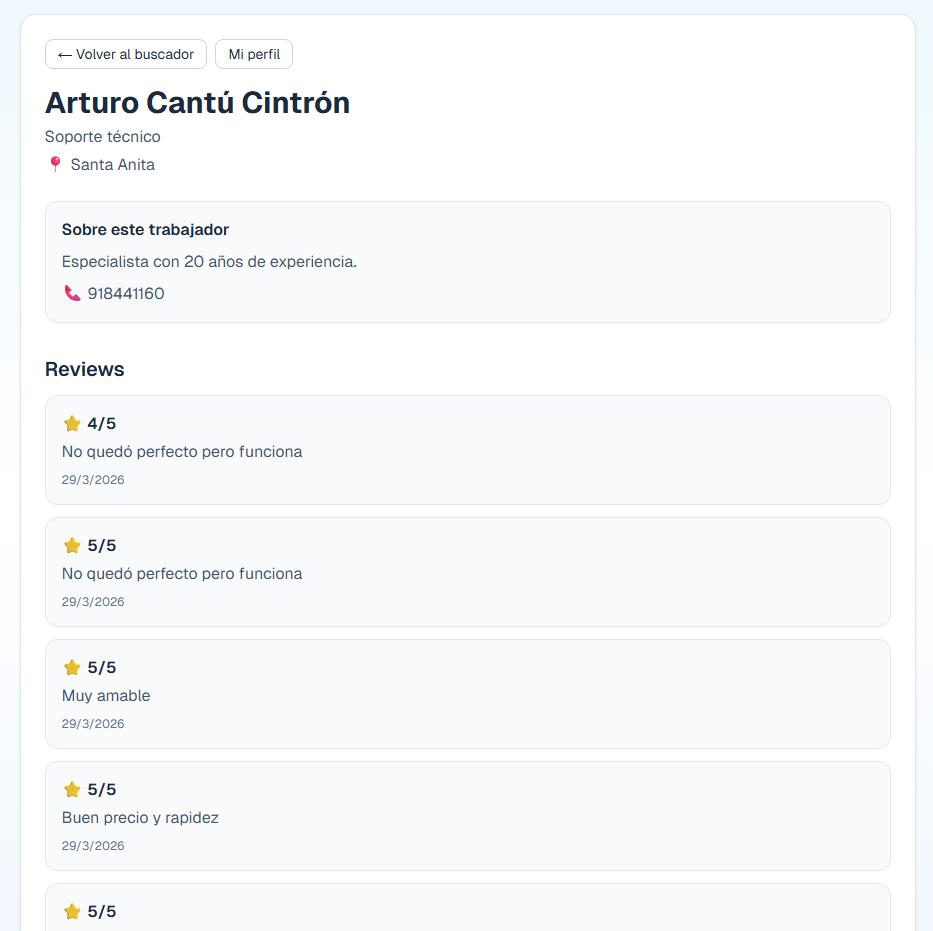

# 🚀 Runamasi – Conectando confianza en tu comunidad

Runamasi es una plataforma web que conecta a personas con trabajadores del hogar (electricistas, plomeros, técnicos, etc.) de forma rápida, confiable y geolocalizada.

Permite encontrar profesionales cercanos, ver sus reseñas y contactarlos directamente, digitalizando el tradicional “boca a boca”.

---

## 🌐 Demo

👉 https://runamasi-nextdeploy-3zwa72-106b8f-157-254-174-134.traefik.me/

---

## 📸 Capturas

### 🏠 Página principal



### 🔐 Buscador



### 👷 Lista de trabajadores




### ⭐ Perfil y reseñas



---

## ⚙️ Tecnologías utilizadas

* **Frontend & Backend:** Next.js
* **Base de datos & Auth:** Supabase
* **Despliegue Dokploy:** Dokploy sobre infraestructura de CubePath
* **Despliegue Supabase:** Se desplegó Supabase self-hosted en otra máquina de Cubepath
* **Estilos:** Tailwind CSS

---

## ☁️ Uso de CubePath (IMPORTANTE)

Este proyecto fue desplegado utilizando la infraestructura proporcionada por CubePath:

* 🖥️ Se utilizó una máquina virtual de CubePath para alojar el proyecto
* 🚀 Se desplegó la aplicación con **Dokploy**, facilitando el manejo del frontend y backend en un solo entorno
* 🗄️ Se implementó una instancia self-hosted de Supabase dentro de otra VM de Cubepath
* 🌐 Se configuraron puertos y reglas de firewall para permitir el acceso externo a la API (puertos 8000 y 8443)
* 🔧 Se realizaron ajustes de red para permitir la comunicación entre la aplicación y Supabase

Esto permitió tener control total del entorno, replicando un escenario real de producción.

---

## 🧠 Decisiones técnicas

* Se utilizó Next.js para unificar frontend y backend en una sola aplicación
* Supabase se eligió por su rapidez para implementar autenticación y base de datos
* Se optó por despliegue en infraestructura propia (CubePath) para mayor control
* Se priorizó rendimiento y simplicidad para un MVP funcional en hackathon

---

## 🚀 Cómo ejecutar localmente

```bash
git clone https://github.com/TU-USUARIO/runamasi
cd runamasi
npm install
npm run dev
```

Configurar variables de entorno:

```env
NEXT_PUBLIC_SUPABASE_URL=...
NEXT_PUBLIC_SUPABASE_ANON_KEY=...
```

---

## 🎯 Problema que resuelve

En Perú, encontrar trabajadores confiables suele depender de recomendaciones informales.
Runamasi digitaliza este proceso, haciéndolo más transparente, accesible y escalable.

---

## 🔮 Futuro

* Sistema de reservas
* Pagos integrados
* Verificación de trabajadores
* Expansión a más ciudades

---

## 👥 Equipo

* Desarrollo y diseño: Mathias Romero

---

## 🏆 Hackathon CubePath

Proyecto desarrollado como parte de la hackathon de Midudev utilizando infraestructura de CubePath.
